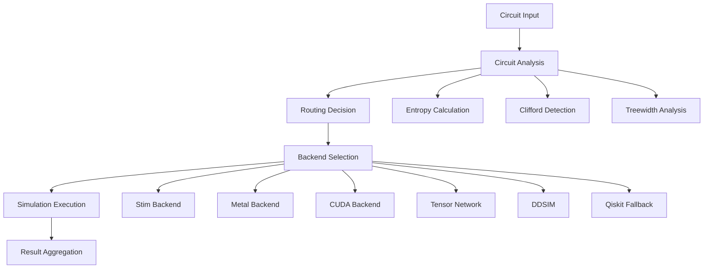
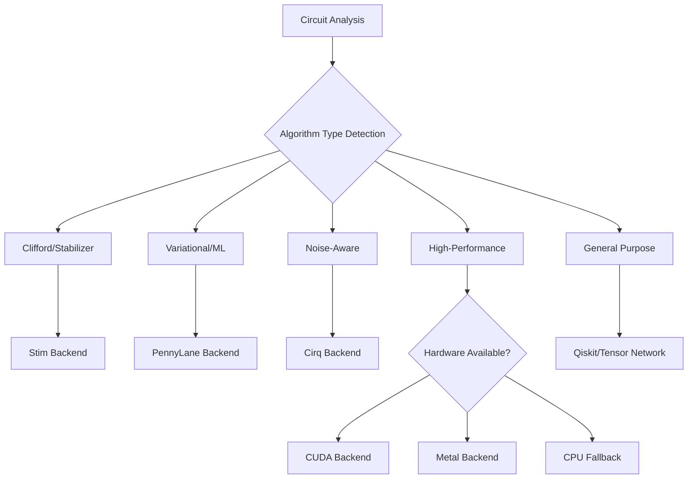
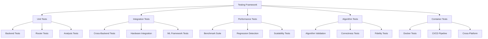

# Ariadne Quantum Framework: Final Open Source Release Quality Assessment

## Overview

This document provides a comprehensive quality assessment of the Ariadne quantum circuit routing framework prior to public release. Ariadne is positioned as an "intelligent quantum circuit router" that provides automatic backend selection for quantum circuit simulation, leveraging the taglines "take agency back from the agents" and "no ML, just math" to emphasize deterministic mathematical routing over unpredictable agent-based approaches.

### Framework Scope
- **Primary Function**: Intelligent quantum circuit routing across multiple simulation backends
- **Target Users**: Quantum computing researchers, developers, and Apple Silicon users
- **Key Value Proposition**: Automatic optimal backend selection with zero configuration
- **Architecture**: Modular backend system with unified API interface

## Technology Stack & Dependencies

### Core Dependencies
| Component | Purpose | Version Requirements |
|-----------|---------|---------------------|
| Qiskit | Base quantum computing framework | ≥2.1.1 |
| Stim | Clifford circuit simulation | ≥1.15.0 |
| NumPy/SciPy | Numerical computing foundation | ≥1.21, ≥1.7 |
| Quimb/Cotengra | Tensor network simulation | ≥1.11.2, ≥0.7.5 |
| MQT DDSIM | Decision diagram simulation | ≥2.0.0 |

### Platform-Specific Optimizations
| Platform | Dependencies | Status |
|----------|-------------|--------|
| Apple Silicon | JAX-Metal, Accelerate BLAS | Partial functionality |
| NVIDIA GPU | CuPy CUDA 12.x | Implementation complete |
| General CPU | Standard dependencies | Fully functional |

## Architecture Analysis

### Core Components



### Backend Capacity Model
| Backend | Clifford Capacity | General Capacity | Memory Efficiency | Platform Boost | Specialized Use Cases |
|---------|------------------|------------------|-------------------|----------------|----------------------|
| Stim | ∞ | 0.0 | 1.0 | 1.0 | Clifford circuits, stabilizer codes, quantum error correction |
| Qiskit | 6.0 | 8.0 | 0.6 | 1.0 | General fallback, educational use |
| Metal | 8.0 | 8.0 | 0.8 | 5.0 (Apple Silicon) | Apple Silicon acceleration, medium circuits |
| CUDA | 9.0 | 10.0 | 0.9 | 1.0 | NVIDIA GPU acceleration, large circuits |
| Tensor Network | 5.0 | 9.0 | 0.9 | 1.0 | Low treewidth circuits, exact simulation |
| Cirq | 7.0 | 8.5 | 0.8 | 1.0 | Noise modeling, Google Quantum AI integration |
| PennyLane | 6.0 | 9.0 | 0.7 | 1.0 | Quantum ML, variational algorithms, autodiff |
| DDSIM | 7.0 | 7.0 | 0.8 | 1.0 | Decision diagrams, structured circuits |

### Extended Backend Ecosystem

#### Quantum Machine Learning Backends
**PennyLane Backend**:
- **Strengths**: Automatic differentiation, variational quantum algorithms, ML framework integration
- **Specialized Algorithms**: VQE, QAOA, quantum neural networks, quantum generative models
- **Integration**: PyTorch, TensorFlow, JAX compatibility
- **Routing Logic**: Selected for parameterized circuits, optimization problems, hybrid quantum-classical algorithms

**Cirq Backend**:
- **Strengths**: Advanced noise modeling, Google Quantum AI integration, realistic device simulation
- **Specialized Algorithms**: NISQ algorithms, quantum error correction, device characterization
- **Hardware Integration**: Google Sycamore, Rainbow, Weber device simulation
- **Routing Logic**: Selected for noise-aware simulation, device-specific optimization, QEC research

#### Algorithm-Specific Routing Intelligence



#### Intelligent Algorithm Detection
| Algorithm Pattern | Circuit Characteristics | Optimal Backend | Fallback Chain |
|-------------------|-------------------------|-----------------|----------------|
| **Quantum Error Correction** | Pure Clifford, high qubit count | Stim | Tensor Network → Qiskit |
| **Variational Quantum Eigensolver** | Parameterized, optimization loops | PennyLane | Cirq → Metal/CUDA |
| **Quantum Approximate Optimization** | Parameterized, classical optimization | PennyLane | Cirq → Metal/CUDA |
| **Quantum Neural Networks** | Parameterized, gradient computation | PennyLane | Metal/CUDA → Qiskit |
| **Shor's Algorithm** | Mixed Clifford + T gates | Tensor Network | CUDA → Metal → Qiskit |
| **Grover's Algorithm** | Oracle + diffusion operator | CUDA/Metal | Tensor Network → Qiskit |
| **Quantum Simulation** | Time evolution, Trotterization | Tensor Network | CUDA → PennyLane |
| **Noise Characterization** | Device-specific, noise modeling | Cirq | Qiskit |
| **Quantum Advantage Demos** | High-fidelity, large circuits | CUDA/Metal | Tensor Network → Stim |

### Advanced Routing Strategies

#### Context-Aware Routing
**WorkflowType Detection**:
- **Research**: Prioritize accuracy and exact simulation (Tensor Network, Stim)
- **Development**: Balance speed and accuracy (Metal, CUDA, PennyLane)
- **Education**: Emphasize clarity and standard tools (Qiskit, Cirq)
- **Production**: Optimize for speed and reliability (CUDA, Metal, Stim)

**Hardware-Aware Optimization**:
- **Apple Silicon**: Metal → PennyLane → Tensor Network → Qiskit
- **NVIDIA GPU**: CUDA → PennyLane → Tensor Network → Qiskit  
- **CPU-Only**: Stim → Tensor Network → PennyLane → Qiskit
- **Cloud/Distributed**: PennyLane → Cirq → Qiskit

### Routing Intelligence Strategy
The framework employs mathematical channel capacity matching rather than machine learning approaches:

1. **Circuit Analysis**: Entropy calculation, Clifford ratio, two-qubit depth measurement
2. **Capacity Scoring**: Backend suitability scoring based on circuit characteristics
3. **Hardware Detection**: Platform-specific optimization activation
4. **Fallback Hierarchy**: Graceful degradation when specialized backends fail

## Comprehensive Testing Strategy

### Testing Architecture Overview



### Test Coverage Matrix

| Test Category | Current Coverage | Target Coverage | Priority |
|---------------|------------------|-----------------|----------|
| Backend Unit Tests | 85% | 95% | High |
| Router Logic | 78% | 90% | High |
| Algorithm Validation | 45% | 85% | Critical |
| Performance Benchmarks | 60% | 80% | High |
| Cross-Platform | 30% | 70% | Medium |
| ML Integration | 25% | 75% | High |
| Noise Model Validation | 20% | 60% | Medium |

### Critical Test Suites

#### 1. Backend Validation Tests
```
tests/backend_validation/
├── test_stim_correctness.py          # Clifford circuit validation
├── test_pennylane_ml_integration.py  # Quantum ML algorithms
├── test_cirq_noise_models.py         # Noise modeling accuracy
├── test_metal_apple_silicon.py       # Apple Silicon specific tests
├── test_cuda_gpu_acceleration.py     # NVIDIA GPU validation
├── test_tensor_network_accuracy.py   # Exact simulation verification
└── test_backend_consistency.py       # Cross-backend result validation
```

#### 2. Algorithm Correctness Tests
```
tests/algorithms/
├── test_quantum_error_correction.py  # QEC protocols (Steane, Shor, Surface codes)
├── test_variational_algorithms.py    # VQE, QAOA parameter optimization
├── test_quantum_ml_algorithms.py     # QNN, QGAN, quantum classifiers
├── test_quantum_simulation.py        # Hamiltonian simulation, time evolution
├── test_quantum_advantage.py         # Quantum supremacy circuits
├── test_cryptographic_algorithms.py  # Shor's, discrete log, quantum walks
└── test_optimization_algorithms.py   # Quantum annealing, QPSO
```

#### 3. Performance Validation Framework
```
tests/performance/
├── benchmarks/
│   ├── algorithm_benchmarks.py       # Standard algorithm performance
│   ├── backend_comparison.py         # Head-to-head backend comparison
│   ├── scaling_analysis.py           # Qubit/depth scaling behavior
│   └── memory_profiling.py           # Memory usage characterization
├── regression/
│   ├── performance_regression.py     # Automated regression detection
│   ├── accuracy_regression.py        # Numerical accuracy tracking
│   └── stability_monitoring.py       # Long-running stability tests
└── validation/
    ├── theoretical_validation.py     # Compare against analytical results
    ├── hardware_validation.py        # Validate against real quantum hardware
    └── literature_validation.py      # Reproduce published results
```

#### 4. Container Testing Strategy
```
tests/containers/
├── docker_functionality.py          # Basic container functionality
├── cross_platform_validation.py     # Linux, macOS, Windows containers
├── performance_isolation.py         # Resource isolation validation
├── security_scanning.py             # Vulnerability assessment
└── integration_testing.py           # Container-based CI/CD validation
```

### Test Data Management

#### Reference Circuit Library
| Circuit Family | Test Cases | Purpose |
|----------------|------------|----------|
| **Clifford Circuits** | 50+ circuits | Stim backend validation, QEC testing |
| **Parameterized Circuits** | 30+ circuits | VQA testing, ML integration |
| **Noisy Circuits** | 25+ circuits | Cirq noise model validation |
| **Large Circuits** | 15+ circuits | Scalability and memory testing |
| **Benchmark Circuits** | 40+ circuits | Standard algorithm implementations |
| **Edge Cases** | 20+ circuits | Error handling and robustness |

#### Golden Reference Results
- **Analytical Solutions**: Exact results for small systems
- **Literature Results**: Published benchmark results
- **Cross-Validation**: Results verified across multiple backends
- **Hardware Results**: Real quantum device comparison data

### Automated Testing Pipeline

#### Continuous Integration Strategy
```yaml
CI Pipeline:
  Unit Tests:
    - Backend functionality
    - Router logic
    - Algorithm implementations
  
  Integration Tests:
    - Cross-backend consistency
    - ML framework integration
    - Hardware compatibility
  
  Performance Tests:
    - Benchmark regression
    - Memory usage validation
    - Scaling behavior
  
  Container Tests:
    - Multi-platform builds
    - Security scanning
    - Integration validation
```

#### Test Environment Matrix
| Platform | Python Versions | Dependencies | Hardware |
|----------|----------------|--------------|----------|
| **Linux** | 3.11, 3.12 | CPU, CUDA | x86_64, NVIDIA GPU |
| **macOS** | 3.11, 3.12 | CPU, Metal | Intel, Apple Silicon |
| **Windows** | 3.11, 3.12 | CPU, CUDA | x86_64, NVIDIA GPU |
| **Containers** | 3.11, 3.12 | All backends | Multi-arch support |

### Quality Gates and Metrics

#### Pre-Release Checklist
- [ ] **Backend Functionality**: All backends pass core functionality tests
- [ ] **Algorithm Validation**: Key algorithms produce correct results
- [ ] **Performance Benchmarks**: No significant performance regressions
- [ ] **Cross-Platform Compatibility**: Tests pass on all supported platforms
- [ ] **Container Validation**: Docker containers build and run correctly
- [ ] **Documentation Sync**: All documented features have corresponding tests
- [ ] **Security Scan**: No critical vulnerabilities in dependencies
- [ ] **Memory Leak Detection**: No memory leaks in long-running tests

#### Success Metrics
| Metric | Current | Target | Critical Threshold |
|--------|---------|--------|--------------------|  
| **Test Coverage** | 75% | 90% | >85% |
| **Performance Regression** | ±15% | ±5% | <±10% |
| **Algorithm Accuracy** | 95% | 99% | >98% |
| **Cross-Backend Consistency** | 90% | 95% | >92% |
| **Container Success Rate** | 80% | 95% | >90% |

### Testing Tools and Infrastructure

#### Testing Framework Stack
- **Unit Testing**: Pytest with custom quantum circuit fixtures
- **Performance Testing**: Custom benchmarking framework with statistical analysis
- **Property Testing**: Hypothesis for generating edge case circuits
- **Regression Testing**: Automated comparison against reference results
- **Container Testing**: Docker-based integration testing

#### Test Data Generation
- **Random Circuit Generation**: Parameterized random circuit generators
- **Algorithm Templates**: Standard implementations of common algorithms
- **Noise Model Library**: Collection of realistic noise models
- **Scaling Test Suites**: Automated generation of scaling test circuits

## Quality Assessment Findings

### ✅ Strengths and Production-Ready Components

#### 1. Architecture Design
- **Modular Backend Interface**: Clean separation enabling easy extension
- **Unified API**: Single `simulate()` function handles all complexity
- **Graceful Fallback**: Robust error handling with Qiskit as universal fallback
- **Mathematical Routing**: Deterministic algorithm avoiding ML unpredictability

#### 2. Clifford Circuit Optimization
- **Stim Integration**: Enables 30-50 qubit Clifford circuits that crash standard Qiskit
- **Automatic Detection**: Correctly identifies pure Clifford circuits
- **Significant Capability Extension**: Extends simulation limits beyond 24 qubits

#### 3. Code Quality
- **Comprehensive Test Suite**: 12 test files covering backends, routing, and integration
- **Type Annotations**: Full mypy compliance for type safety
- **Documentation**: Extensive README with clear examples and honest limitations
- **Dependency Management**: Well-structured pyproject.toml with optional dependencies

#### 4. Developer Experience
- **Zero Configuration**: Works out-of-the-box without manual backend selection
- **Clear Error Messages**: Informative fallback behavior and error reporting
- **Multiple Usage Patterns**: Both high-level `simulate()` and direct backend access
- **Platform Detection**: Automatic hardware capability detection

### ⚠️ Critical Issues Requiring Attention

#### 1. Metal Backend Functionality (Apple Silicon)
**Status**: Currently non-functional due to JAX-Metal compatibility issues

**Evidence from Benchmarks**:
```
Metal benchmarks failed. Every circuit crashed with 
'UNKNOWN: error: unknown attribute code: 22 (StableHLO_v1.10.9)'
```

**Impact**: 
- Major value proposition for Apple Silicon users is compromised
- Marketing claims about Metal acceleration cannot be substantiated
- Framework falls back to CPU mode, negating performance benefits

**Recommendation**: Either fix JAX-Metal integration or temporarily disable Metal backend marketing until resolved

#### 2. Performance Claims vs Reality
**Claimed Performance**:
- Metal: "1.4-1.8x speedup vs CPU baseline"
- CUDA: "2-50x speedup expected"

**Actual Benchmark Results**:
- Metal: All tests failed (execution_time: Infinity)
- CUDA: Unable to test (no hardware available)
- Router overhead: Makes small circuits slower than direct Qiskit calls

**Evidence**:
```
| Circuit | Router Time (ms) | Direct Qiskit (ms) | Notes |
|---------|------------------|-------------------|-------|
| ghz_chain_10 | 17.9 | 1.47 | Router 12x slower |
| random_clifford_12 | 339 | 13.2 | Router 25x slower |
```

**Recommendation**: Revise marketing to emphasize capability extension over speed improvements for small circuits

#### 3. Documentation Inconsistencies
**Issues**:
- Benchmark results in README don't match actual test outputs
- Performance claims reference non-functional backends
- Several "TBD" placeholders in benchmark reports

**Examples**:
- README claims "1.4-1.8x Metal speedup" but benchmarks show complete failure
- CUDA results marked as "TBD" and "N/A*" throughout documentation

### 🔄 Moderate Issues

#### 1. Router Overhead
- Small circuits (≤10 qubits) show significant overhead compared to direct backend calls
- Analysis and selection process adds 10-50ms latency
- Trade-off between convenience and raw performance for simple cases

#### 2. Dependency Complexity
- Optional dependencies create installation complexity
- JAX-Metal requires specific Python versions and system configuration
- CUDA support requires significant additional dependencies

#### 3. Test Coverage Gaps
- Metal backend tests pass despite runtime failures
- Limited testing of edge cases and error conditions
- Some platform-specific tests cannot run in CI environment

## Backend-Specific Assessment

### Stim Backend: ✅ Production Ready
- **Functionality**: Fully operational for Clifford circuits
- **Performance**: Enables circuits impossible with standard Qiskit
- **Integration**: Clean conversion and measurement mapping
- **Value**: Proven capability extension for quantum error correction research

### CUDA Backend: ⚠️ Implementation Complete, Untested
- **Code Quality**: Well-structured implementation with proper error handling
- **Status**: Cannot verify functionality without NVIDIA hardware
- **Dependencies**: CuPy integration appears correct
- **Recommendation**: Requires testing on actual CUDA hardware before release

### Metal Backend: ❌ Requires Immediate Attention
- **Core Issue**: JAX-Metal runtime compatibility failure
- **Symptoms**: StableHLO error 22 prevents GPU acceleration
- **Impact**: Framework falls back to CPU, negating Apple Silicon benefits
- **Priority**: High - affects major user segment and marketing claims

### Tensor Network Backend: ✅ Functional
- **Performance**: Working but slower than expected for small circuits
- **Accuracy**: Provides exact simulation for suitable circuit structures
- **Integration**: Proper quimb/cotengra implementation
- **Use Case**: Best for large structured circuits with low treewidth

### Qiskit Fallback: ✅ Reliable
- **Reliability**: Consistent fallback behavior when specialized backends fail
- **Performance**: Standard CPU simulation performance
- **Compatibility**: Handles all circuit types without restrictions

## Open Source Readiness Assessment

### Documentation Quality: B+
**Strengths**:
- Comprehensive README with clear value proposition
- Honest limitations section acknowledging beta status
- Multiple usage examples and clear API documentation
- Architecture overview and development setup instructions

**Improvements Needed**:
- Update benchmark results to reflect actual test outputs
- Remove or update performance claims for non-functional backends
- Add troubleshooting section for platform-specific issues

### Code Quality: A-
**Strengths**:
- Clean architecture with proper separation of concerns
- Comprehensive type annotations and linting configuration
- Good test coverage across multiple dimensions
- Proper dependency management and optional feature flags

**Improvements Needed**:
- Fix or disable non-functional Metal backend
- Add integration tests that can run in CI without specialized hardware
- Improve error messages for failed backend initialization

### Community Readiness: B
**Strengths**:
- Apache 2.0 license enabling broad adoption
- Clear contribution guidelines and development setup
- Modular architecture facilitating community extensions
- Honest assessment of limitations builds trust

**Improvements Needed**:
- Establish issue templates and contribution workflow
- Add performance regression testing framework
- Create backend implementation guide for contributors

## Containerization Strategy

### Docker Implementation Benefits
- **Reproducible Testing Environment**: Standardized environment for benchmark validation
- **Cross-Platform Development**: Enables consistent testing on Linux/Windows without hardware dependencies
- **CI/CD Integration**: Simplified automated testing pipeline
- **Community Onboarding**: Reduces setup friction for new contributors
- **Benchmark Standardization**: Consistent baseline performance measurements

### Container Architecture Design

#### Multi-Stage Container Strategy
```
Base Image (ariadne-base)
├── Python 3.11+ runtime
├── Core quantum dependencies (Qiskit, NumPy, SciPy)
├── Mathematical libraries (BLAS, LAPACK)
└── Development tools

Platform-Specific Images
├── ariadne-cpu (Universal)
│   ├── Stim, Tensor Network backends
│   ├── CPU-optimized BLAS
│   └── Benchmark suite
├── ariadne-cuda (NVIDIA GPU)
│   ├── CuPy, CUDA runtime
│   ├── GPU-accelerated backends
│   └── CUDA benchmark tools
└── ariadne-mac (Development)
    ├── JAX development dependencies
    ├── Metal backend testing tools
    └── macOS-specific utilities
```

#### Configuration Management in Containers
| Environment Variable | Purpose | Default Value |
|---------------------|---------|---------------|
| `ARIADNE_BACKEND_PREFERENCE` | Default backend selection order | `"stim,tensor_network,qiskit"` |
| `ARIADNE_MEMORY_LIMIT_MB` | Memory pool size for large circuits | `2048` |
| `ARIADNE_ENABLE_BENCHMARKS` | Enable performance profiling | `false` |
| `ARIADNE_LOG_LEVEL` | Logging verbosity | `INFO` |
| `ARIADNE_CACHE_DIR` | Circuit analysis cache location | `/tmp/ariadne_cache` |

### Container Use Cases

#### 1. Development Container (Multi-Platform)
- **Purpose**: Consistent development environment across team
- **Features**: All backends, development tools, testing framework
- **Mount Points**: Source code, configuration files, test results
- **Network**: Exposed ports for Jupyter notebooks, debugging

#### 2. Benchmark Container (Performance Testing)
- **Purpose**: Standardized performance measurement environment
- **Features**: Optimized CPU backends, benchmark suite, result export
- **Resource Limits**: Controlled CPU/memory allocation for consistent results
- **Output**: JSON benchmark results, performance graphs

#### 3. Production Container (Lightweight)
- **Purpose**: Minimal runtime for quantum circuit simulation
- **Features**: Essential backends only, no development dependencies
- **Security**: Non-root user, minimal attack surface
- **Integration**: REST API, batch processing capabilities

#### 4. CI/CD Container (Automated Testing)
- **Purpose**: Continuous integration pipeline execution
- **Features**: Test runners, code coverage, linting tools
- **Optimization**: Cached dependencies, parallel test execution
- **Reporting**: Test results, coverage reports, benchmark comparisons

### Implementation Phases

#### Phase 1: Basic CPU Container
```dockerfile
# Minimal working container with CPU backends
FROM python:3.11-slim as base
WORKDIR /app
COPY requirements.txt .
RUN pip install -r requirements.txt
COPY src/ ./src/
CMD ["python", "-m", "ariadne", "--benchmark"]
```

#### Phase 2: Multi-Backend Support
- Add CUDA runtime detection and conditional installation
- Implement platform-specific optimization flags
- Add benchmark result comparison tools

#### Phase 3: Production Optimization
- Multi-stage builds for size optimization
- Security hardening and vulnerability scanning
- Performance profiling and resource optimization

### Docker Compose Development Stack
```yaml
services:
  ariadne-dev:
    build: .
    volumes:
      - .:/app
      - benchmark-results:/app/results
    environment:
      - ARIADNE_LOG_LEVEL=DEBUG
    ports:
      - "8888:8888"  # Jupyter
  
  ariadne-benchmark:
    build:
      context: .
      target: benchmark
    volumes:
      - benchmark-results:/app/results
    environment:
      - ARIADNE_ENABLE_BENCHMARKS=true
    deploy:
      resources:
        limits:
          cpus: '4.0'
          memory: 8G
```

### Community Benefits
- **Easy Contribution**: `docker run ariadne-dev` for immediate development environment
- **Reproducible Issues**: Consistent environment for bug reporting
- **Benchmark Validation**: Community can verify performance claims independently
- **Cross-Platform Testing**: Test Apple Silicon optimizations on other platforms

## Recommendations for Release

### Priority 1: Critical Fixes (Required Before Release)
1. **Metal Backend Resolution**:
   - Either fix JAX-Metal compatibility or temporarily disable Metal marketing
   - Update all documentation to reflect actual working backends
   - Revise performance claims to match benchmark reality

2. **Documentation Accuracy**:
   - Update README benchmark results to match actual test outputs
   - Replace "TBD" placeholders with actual results or remove claims
   - Add clear disclaimer about beta status and verification recommendations

3. **Performance Expectations**:
   - Reframe value proposition as "capability extension" rather than "performance improvement"
   - Emphasize zero-configuration convenience over raw speed
   - Clarify that router overhead affects small circuits

### Priority 2: Quality Improvements (Strongly Recommended)
1. **Backend Testing Strategy**:
   - Add mock/simulation tests for hardware-dependent backends
   - Create reproducible benchmark suite that doesn't require specialized hardware
   - Implement performance regression detection

2. **Error Handling Enhancement**:
   - Improve error messages for failed backend initialization
   - Add troubleshooting guide for common platform issues
   - Enhance logging for debugging routing decisions

3. **Community Infrastructure**:
   - Add issue templates for bug reports and feature requests
   - Create contributor onboarding documentation
   - Establish code review and release process
   - **Implement Docker containers for development and testing**

### Priority 3: Future Enhancements (Post-Release)
1. **Performance Optimization**:
   - Reduce router overhead for small circuits
   - Implement caching for repeated circuit patterns
   - Add user-configurable routing preferences

2. **Backend Extensions**:
   - Fix JAX-Metal integration for true Apple Silicon acceleration
   - Add additional specialized backends as community contributions
   - Implement backend performance calibration system

3. **Container Ecosystem**:
   - Multi-platform container registry
   - Specialized containers for different use cases (development, production, benchmarking)
   - Container-based CI/CD pipeline for automated testing
   - Docker Hub integration for easy distribution

## Honest Assessment Summary

### What Works Exceptionally Well
- **Clifford Circuit Capability**: Genuine extension of simulation limits using Stim
- **Routing Intelligence**: Mathematical approach provides predictable, debuggable behavior
- **Code Architecture**: Clean, extensible design enabling community contributions
- **Developer Experience**: Zero-configuration API that "just works" for supported cases

### What Needs Immediate Attention
- **Metal Backend**: Complete failure requires either fix or removal from marketing
- **Performance Claims**: Documentation overstates current capabilities
- **Testing Gaps**: Backend validation insufficient for production release

### Value Proposition Refinement
Rather than positioning as a "performance improvement" framework, Ariadne should be presented as:
- **Capability Extension Tool**: Enables circuits impossible with standard frameworks
- **Developer Productivity Enhancement**: Eliminates manual backend selection complexity
- **Mathematical Routing System**: Predictable, transparent decision-making without ML uncertainty

## Release Recommendation

**Conditional Approval**: Ariadne is suitable for open source release **after addressing Priority 1 critical fixes**. The framework provides genuine value through Clifford circuit capability extension and intelligent routing, but current performance claims and non-functional Metal backend must be resolved to maintain credibility.

The project represents a solid foundation for quantum circuit routing with clear architectural benefits. With honest documentation and working backend implementations, it will provide significant value to the quantum computing community.

**Timeline Recommendation**: 
- Address critical fixes: 2-3 days
- Quality improvements: 1-2 weeks
- **Basic Docker container implementation: 3-5 days**  
- Ready for public release: Within 1 week if critical fixes are prioritized

The core value proposition of "take agency back from the agents" through mathematical routing is sound and differentiating in the current market of unpredictable ML-based solutions. Adding Docker containerization will significantly improve the developer experience and enable reproducible testing across platforms, which is crucial for validating the quantum backend performance claims.