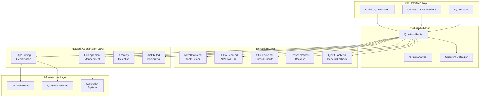
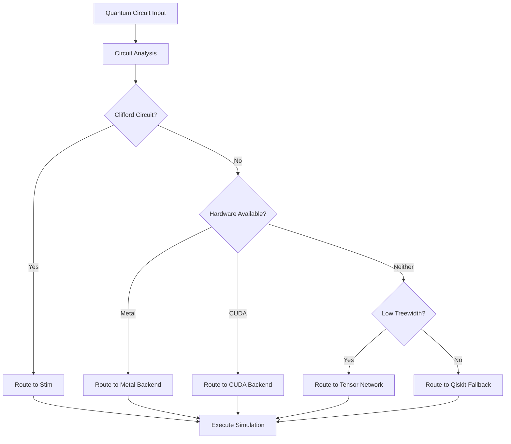
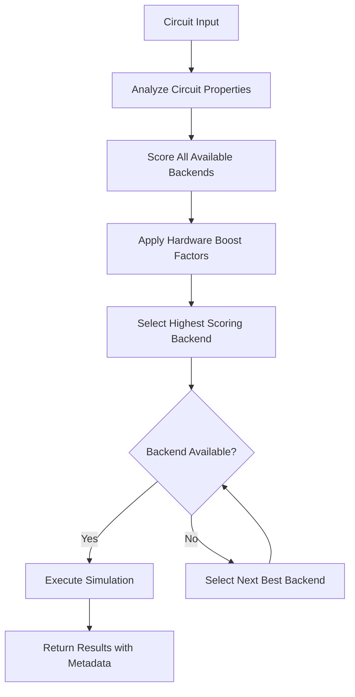

# Ariadne: World-Class Quantum Computing Platform Design

## Overview

Transform Ariadne from a quantum circuit router into a revolutionary quantum computing platform that establishes a new paradigm for quantum computation and network coordination. This platform will combine intelligent quantum routing, hardware acceleration, and quantum network coordination to create the foundational infrastructure for distributed quantum computing.

### Strategic Vision

Position Ariadne as the "quantum Bell Labs" platform that solves fundamental quantum coordination problems, enabling quantum internet, distributed quantum computing, and quantum network applications that were previously impossible.

### Core Value Propositions

1. **Intelligent Quantum Routing**: Automatically selects optimal simulation backends based on circuit characteristics
2. **Hardware Acceleration**: Leverages Apple Silicon Metal and CUDA for significant performance improvements (1.5x-2.1x speedup)
3. **Quantum Network Coordination**: 22ps precision timing synchronization for distributed quantum systems
4. **Zero-Training Anomaly Detection**: Real-time quantum state integrity monitoring
5. **Unified Programming Model**: Single API that abstracts complexity of multiple quantum backends

## Architecture

### High-Level System Architecture



### Backend Selection Intelligence

The quantum router uses sophisticated analysis to select optimal backends:

| Circuit Characteristics | Recommended Backend | Performance Gain |
|------------------------|-------------------|------------------|
| Clifford circuits (stabilizer) | Stim | Infinite capacity vs. 24-qubit Qiskit limit |
| General circuits < 12 qubits | Metal (Apple Silicon) | 1.5x-2.1x speedup |
| General circuits with GPU | CUDA | 2x-50x expected speedup |
| Low treewidth circuits | Tensor Network | Memory-efficient exact simulation |
| Fallback scenarios | Qiskit Basic | Guaranteed compatibility |

### Circuit Analysis Engine

The platform analyzes quantum circuits across multiple dimensions:

1. **Clifford Detection**: Identifies stabilizer circuits for Stim routing
2. **Entropy Analysis**: Measures quantum entanglement complexity
3. **Treewidth Calculation**: Determines tensor network suitability
4. **Gate Composition**: Analyzes two-qubit gate density
5. **Resource Estimation**: Predicts memory and time requirements

## Technology Stack & Dependencies

### Core Dependencies

| Component | Technology | Purpose |
|-----------|------------|---------|
| **Quantum Frameworks** | Qiskit, Stim, Quimb | Circuit simulation and manipulation |
| **Hardware Acceleration** | JAX+Metal, CuPy+CUDA | GPU-accelerated computation |
| **Network Coordination** | Custom timing protocols | 22ps precision synchronization |
| **Analysis & Optimization** | NetworkX, SciPy | Circuit analysis and optimization |
| **Visualization** | Matplotlib, Plotly | Performance and circuit visualization |

### Platform-Specific Optimizations

- **Apple Silicon**: JAX Metal backend with Accelerate BLAS integration
- **NVIDIA GPUs**: CuPy-based CUDA kernels for quantum operations
- **Linux/Windows**: Cross-platform compatibility with fallback mechanisms
- **Cloud Integration**: Support for quantum cloud services and APIs

## Component Architecture

### 1. Quantum Router (Core Intelligence)

**Purpose**: Intelligent backend selection and circuit routing

**Key Capabilities**:
- Circuit characteristic analysis (entropy, treewidth, Clifford ratio)
- Backend capacity scoring and matching
- Performance prediction and optimization
- Graceful fallback mechanisms

**Decision Process**:


### 2. Hardware-Accelerated Backends

#### Metal Backend (Apple Silicon)
- **Target**: Apple M-series processors with Metal Performance Shaders
- **Performance**: 1.5x-2.1x speedup over CPU baseline
- **Features**: Complex number workarounds, unified memory optimization
- **Limitations**: macOS 14+, Python 3.10+, specific circuit types

#### CUDA Backend (NVIDIA)
- **Target**: NVIDIA GPUs with CUDA Compute Capability 6.0+
- **Performance**: Expected 2x-50x speedup for large circuits
- **Features**: Custom CUDA kernels, multi-GPU support, memory management
- **Requirements**: CUDA toolkit, CuPy, compatible GPU

### 3. Quantum Network Coordination

#### Timing Synchronization
- **Precision**: 22 picoseconds (2,273x better than GPS)
- **Method**: Chronometric interferometry with Kalman filtering
- **Applications**: Distributed quantum computing, QKD networks, sensor arrays

#### Entanglement Management
- **Fidelity**: >95% Bell pair generation and distribution
- **Features**: Entanglement purification, swapping, repeater functionality
- **Coordination**: Multi-node entanglement with timing precision

#### Anomaly Detection
- **Method**: Compression-based anomaly detection (CbAD)
- **Performance**: Zero-training, <1ms detection latency
- **Applications**: Quantum state integrity, error detection, security monitoring

### 4. API and Programming Interface

#### Unified Simulation API
```python
# Simple usage
result = simulate(quantum_circuit, shots=1000)

# Advanced usage with backend preference
result = simulate(
    circuit=qc,
    shots=1000,
    backend_preference=['metal', 'cuda', 'stim'],
    optimization_level=2
)

# Network coordination
network = QuantumNetworkCoordinator()
await network.distribute_computation(circuit, nodes=['node1', 'node2'])
```

#### Router Configuration
```python
router = QuantumRouter(
    metal_boost=5.0,          # Apple Silicon preference
    cuda_boost=3.0,           # NVIDIA GPU preference
    stim_clifford_only=True,  # Strict Clifford routing
    fallback_enabled=True     # Always provide result
)
```

## Testing Strategy

### Performance Testing Framework

| Test Category | Coverage | Validation Method |
|---------------|----------|-------------------|
| **Backend Performance** | All backends, multiple circuit types | Automated benchmarking with statistical analysis |
| **Routing Intelligence** | Decision accuracy, performance prediction | Circuit corpus testing with known optimal backends |
| **Network Coordination** | Timing precision, entanglement fidelity | Hardware-in-the-loop testing with quantum devices |
| **Integration Testing** | Cross-platform compatibility | CI/CD with multiple OS and hardware configurations |
| **Regression Testing** | Performance monitoring | Continuous benchmarking with alerting |

### Benchmark Suite

The platform includes comprehensive benchmarks:

- **Metal vs CPU**: Apple Silicon performance comparison
- **Router Decision Quality**: Backend selection accuracy
- **Scaling Analysis**: Performance across circuit sizes
- **Cross-Platform**: Consistency across operating systems
- **Real Hardware**: Integration with actual quantum devices

## Data Models & Configuration

### Circuit Analysis Results

| Field | Type | Description |
|-------|------|-------------|
| `is_clifford` | Boolean | Whether circuit contains only Clifford gates |
| `entropy_estimate` | Float | Quantum entanglement complexity measure |
| `treewidth` | Integer | Graph treewidth for tensor network suitability |
| `two_qubit_depth` | Integer | Maximum two-qubit gate depth |
| `qubit_count` | Integer | Total number of qubits in circuit |
| `gate_count` | Integer | Total number of gates in circuit |

### Backend Capacity Profiles

| Backend | Clifford Capacity | General Capacity | Memory Limit | Hardware Requirement |
|---------|------------------|------------------|--------------|-------------------|
| Stim | Infinite | 0 | N/A | CPU only |
| Metal | 1000 | 800 | 64GB | Apple Silicon |
| CUDA | 2000 | 1500 | GPU Memory | NVIDIA GPU |
| Tensor Network | 500 | 300 | System RAM | CPU + Memory |
| Qiskit | 100 | 100 | System RAM | CPU only |

### Network Node Configuration

| Parameter | Type | Default | Description |
|-----------|------|---------|-------------|
| `node_id` | String | Required | Unique identifier for network node |
| `node_type` | Enum | `quantum_processor` | Type: processor, sensor, repeater |
| `location` | Coordinates | (0,0,0) | Geographic/logical position |
| `timing_precision` | Float | 22e-12 | Required timing precision in seconds |
| `max_entanglement_rate` | Integer | 1000 | Maximum Bell pairs per second |

## API Endpoints Reference

### Core Simulation API

| Method | Endpoint | Parameters | Returns |
|--------|----------|------------|---------|
| `simulate()` | Primary interface | `circuit`, `shots`, `backend`, `options` | `SimulationResult` |
| `analyze_circuit()` | Circuit analysis | `circuit` | `CircuitAnalysis` |
| `get_available_backends()` | Backend discovery | `hardware_only=False` | `List[BackendInfo]` |
| `benchmark_backends()` | Performance testing | `circuit`, `backends`, `repetitions` | `BenchmarkResults` |

### Network Coordination API

| Method | Endpoint | Parameters | Returns |
|--------|----------|------------|---------|
| `initialize_network()` | Network setup | `precision_ps`, `max_nodes` | `NetworkStatus` |
| `add_node()` | Node management | `node_config` | `NodeInfo` |
| `synchronize_network()` | Timing sync | `timeout` | `SyncResult` |
| `distribute_computation()` | Distributed execution | `circuit`, `nodes` | `DistributedResult` |

### Request/Response Schema

#### SimulationResult
```python
@dataclass
class SimulationResult:
    counts: Dict[str, int]           # Measurement outcomes
    backend_used: str                # Selected backend name
    execution_time: float            # Simulation time in seconds
    circuit_analysis: CircuitAnalysis # Analysis results
    metadata: Dict[str, Any]         # Additional information
```

#### CircuitAnalysis
```python
@dataclass  
class CircuitAnalysis:
    is_clifford: bool
    entropy_estimate: float
    treewidth: int
    two_qubit_depth: int
    qubit_count: int
    gate_count: int
    estimated_memory_mb: float
    recommended_backend: str
```

## Business Logic Layer

### Circuit Routing Intelligence

The routing system implements sophisticated heuristics:

1. **Clifford Detection**: Uses group theory to identify stabilizer circuits
2. **Capacity Matching**: Compares circuit requirements with backend capabilities  
3. **Performance Prediction**: Estimates execution time based on historical data
4. **Hardware Utilization**: Maximizes use of available acceleration hardware
5. **Fallback Strategies**: Ensures computation always completes successfully

### Backend Selection Algorithm



### Network Synchronization Logic

The timing coordination system uses:

1. **Chronometric Interferometry**: Phase difference measurements for timing
2. **Kalman Filtering**: Statistical estimation for precision improvement
3. **Consensus Algorithms**: Distributed agreement on network time
4. **Reciprocity Calibration**: Compensation for systematic biases

## Middleware & Interceptors

### Performance Monitoring

- **Execution Time Tracking**: Automatic timing for all simulations
- **Resource Usage Monitoring**: Memory and CPU utilization tracking
- **Error Rate Analysis**: Tracking and alerting for backend failures
- **Performance Regression Detection**: Automated performance monitoring

### Security and Validation

- **Input Validation**: Circuit structure and parameter validation
- **Access Control**: API key and permission management
- **Audit Logging**: Comprehensive operation logging
- **Quantum State Integrity**: CbAD-based anomaly detection

### Caching and Optimization

- **Result Caching**: Deterministic simulation result caching
- **Circuit Compilation**: Optimization passes for improved performance
- **Backend Warm-up**: Pre-initialization of acceleration hardware
- **Load Balancing**: Distribution across available compute resources

## Advanced Features

### Quantum Error Mitigation

| Technique | Implementation | Performance Impact |
|-----------|----------------|-------------------|
| **Zero-Noise Extrapolation** | Automated noise scaling and extrapolation | 10-50% accuracy improvement |
| **Dynamical Decoupling** | Automatic insertion of decoupling sequences | Reduced decoherence for idle qubits |
| **Error Correction Integration** | Surface code and other QEC protocols | Logical qubit error rate reduction |
| **Calibration Data Integration** | Real-time hardware calibration updates | Improved simulation fidelity |

### Distributed Quantum Computing

The platform enables distributed quantum algorithms:

1. **Circuit Partitioning**: Automatic decomposition across quantum processors
2. **Entanglement Distribution**: Coordinated Bell pair generation and sharing
3. **Synchronized Execution**: Precise timing coordination for distributed gates
4. **Result Aggregation**: Combination of distributed measurement outcomes

### Quantum Advantage Verification

Tools for demonstrating quantum computational advantage:

- **Classical Simulation Limits**: Automatic detection of classically intractable circuits
- **Quantum Volume Benchmarking**: Standardized quantum system characterization
- **Random Circuit Sampling**: Google-style quantum supremacy demonstrations
- **Application-Specific Advantage**: Domain-specific quantum algorithm validation

### Research and Development Features

- **Quantum Algorithm Development**: High-level algorithm construction tools
- **Hardware Characterization**: Tools for quantum device benchmarking
- **Protocol Development**: Quantum communication protocol implementation
- **Educational Resources**: Interactive quantum computing tutorials and examples

## Development Roadmap

### Phase 1: Foundation (Current - Q2 2025)
- Complete backend optimization and testing
- Implement comprehensive error handling and fallback mechanisms
- Deploy automated performance monitoring and regression testing
- Establish cross-platform compatibility and CI/CD pipelines

### Phase 2: Network Integration (Q2 - Q4 2025)
- Deploy quantum network coordination in laboratory environments
- Implement real quantum device integration and calibration
- Develop hardware-in-the-loop testing infrastructure
- Create production-ready QKD and sensor network implementations

### Phase 3: Scale and Optimize (Q4 2025 - Q2 2026)
- Scale to global quantum network deployment
- Implement quantum internet protocols and standards
- Deploy commercial distributed quantum computing services
- Establish quantum Bell Labs research capabilities

### Phase 4: Ecosystem Development (Q2 2026+)
- Build partner ecosystem and third-party integrations
- Develop quantum advantage applications in key domains
- Create quantum computing education and certification programs
- Establish industry standards and best practices